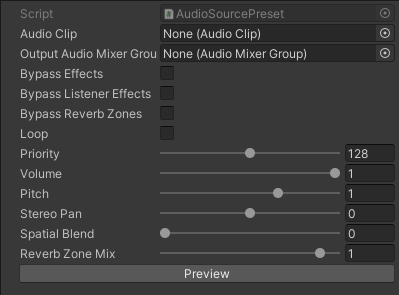
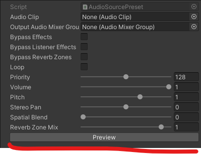

# Audio Source Preset
A Unity Scriptable Object that contains the usual data provided by the Audio Source. Made in 2022.3.47f1.



## How to use
### Creation

To create an Audio Source Preset Scriptable Object, right click and find:

```
YergoLabs/Sounds/Audio Source Preset
```

### Preview

Click the Preview Button to play the preset.



### Code

Scripts are placed inside the <b> YergoLabs.Sounds </b> namespace.

```
using YergoLabs.Sounds;
using UnityEngine;

public class Foo : MonoBehaviour
{
    [SerializedField] private AudioSourcePreset _AudioSourcePreset;
}
```

I have included extension methods to help apply the settings in the preset.

```
using YergoLabs.Sounds;
using UnityEngine;

public class Foo : MonoBehaviour
{
    [SerializeField] private AudioSource _AudioSource;
    [SerializeField] private AudioSourcePreset _AudioSourcePreset;

    private void Awake()
    {
        _AudioSource.SetPreset(_AudioSourcePreset);
    }
}
```